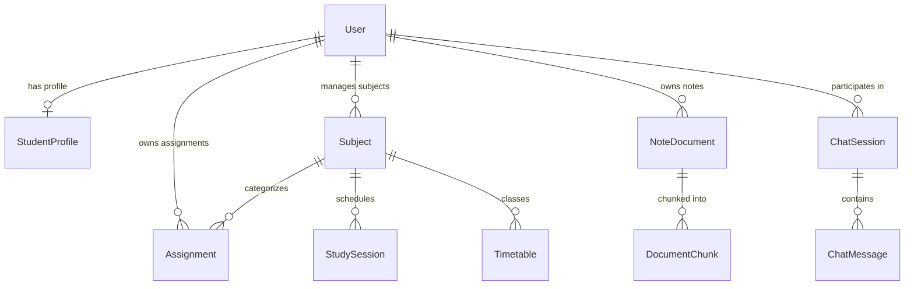

# Database Architecture & Prisma Schema Reference

**Database Engine**: PostgreSQL 16  
**ORM**: Prisma ORM 6.4  
**Primary Mapping Strategy**: Snake_case table names (`@@map`) with PascalCase Prisma models.

---

## 1. Database Overview & Security Model

The database stores all student-related data: personal profiles, course assignments, weekly revision schedules, uploaded course notes, chunk embeddings, and persistent chat sessions.

### Multi-Tenant User Isolation
Every personal table contains a non-nullable `userId` foreign key referencing the `User` model with `onDelete: Cascade`.

- **Security Enforcement**: The application layer enforces `userId = context.userId` on all reads, writes, updates, and deletes.
- **No Client Tampering**: Client requests to `/api/chat` or `/api/assignments` do not permit supplying a custom `userId`. All operations bind to the authenticated student context.
- **RAG Chunk Isolation**: The `DocumentChunk` table indexes `userId`, ensuring that semantic vector searches only compute cosine similarity against chunks owned by the querying student.

---

## 2. Core Entity Relationship Diagram

---

## 3. Enumerations

### `Priority`
Used in `Assignment` to prioritize coursework urgency:
- `LOW`: Standard optional review.
- `MEDIUM`: Standard coursework (default).
- `HIGH`: Major lab submission or midterm project.
- `URGENT`: Deliverable due imminently or overdue.

### `Status`
Tracks lifecycle of an `Assignment`:
- `PENDING`: Active, incomplete assignment (default).
- `IN_PROGRESS`: In-flight deliverable.
- `COMPLETED`: Finished and submitted.

### `MessageRole`
Identifies the speaker in `ChatMessage`:
- `USER`: Student prompt.
- `ASSISTANT`: AI Student Agent response.
- `SYSTEM`: Operational prompt injection or system boundary.

---

## 4. Models Specification

### 1. `User` (Table: `users`)
The primary account entity for authentication and data ownership.

| Field | Type | Attributes | Description |
|---|---|---|---|
| `id` | `String` | `@id @default(cuid())` | Unique user identifier |
| `name` | `String` | | Student's full name |
| `email` | `String` | `@unique` | Student university email |
| `password` | `String?` | | Password hash (nullable for OAuth) |
| `createdAt` | `DateTime` | `@default(now())` | Account creation timestamp |
| `updatedAt` | `DateTime` | `@updatedAt` | Last modification timestamp |

**Relations**:
- `studentProfile`: Optional 1-to-1 relationship with `StudentProfile`.
- `assignments`: 1-to-many relationship with `Assignment`.
- `noteDocuments`: 1-to-many relationship with `NoteDocument`.
- `chatSessions`: 1-to-many relationship with `ChatSession`.

---

### 2. `StudentProfile` (Table: `student_profiles`)
Stores academic enrollment attributes and technical skills for personalized mentorship.

| Field | Type | Attributes | Description |
|---|---|---|---|
| `id` | `String` | `@id @default(cuid())` | Unique profile identifier |
| `userId` | `String` | `@unique` | Foreign key referencing `User(id)` |
| `college` | `String?` | | University school/department name |
| `course` | `String?` | | Enrolled degree program (e.g. *B.Tech Computer Science & AI*) |
| `semester` | `Int?` | | Current semester (e.g. `4`) |
| `skills` | `String[]` | `@default([])` | Array of technical proficiencies |
| `careerGoals` | `String?` | | Target career trajectory |

**Isolation**: 1-to-1 strictly bound to `userId`.

---

### 3. `Assignment` (Table: `assignments`)
Manages academic homework, problem sets, and submission deadlines.

| Field | Type | Attributes | Description |
|---|---|---|---|
| `id` | `String` | `@id @default(cuid())` | Unique assignment identifier |
| `userId` | `String` | | Foreign key referencing `User(id)` |
| `title` | `String` | | Assignment title (e.g. *Graph Theory Problem Set 3*) |
| `description`| `String?` | | Optional instructions |
| `subject` | `String?` | | Course name or code string |
| `subjectId` | `String?` | | Optional foreign key referencing `Subject(id)` |
| `dueDate` | `DateTime` | | Explicit deadline timestamp |
| `priority` | `Priority` | `@default(MEDIUM)` | Urgency level |
| `status` | `Status` | `@default(PENDING)` | Current progress state |
| `createdAt` | `DateTime` | `@default(now())` | Creation timestamp |

**Isolation & Indexing**: Queries in `getAssignments` and `getUpcomingDeadlines` filter `where: { userId }` with date ranges `[now, now + days]`.

---

### 4. `NoteDocument` (Table: `note_documents`)
Represents an uploaded lecture handout or course PDF in the RAG knowledge base.

| Field | Type | Attributes | Description |
|---|---|---|---|
| `id` | `String` | `@id @default(cuid())` | Unique document identifier |
| `userId` | `String` | | Foreign key referencing `User(id)` |
| `title` | `String` | | Document title (e.g. *CS301: Timsort Analysis & Origins*) |
| `fileName` | `String` | | Original uploaded file name (e.g. *CS301_Timsort_Notes.pdf*) |
| `fileSize` | `Int` | | File size in bytes |
| `pageCount` | `Int` | `@default(1)` | Number of pages parsed |
| `subject` | `String?` | | Optional associated course code |
| `createdAt` | `DateTime` | `@default(now())` | Upload timestamp |
| `updatedAt` | `DateTime` | `@updatedAt` | Last modification timestamp |

**Relations**: 1-to-many with `DocumentChunk`. Deleting a `NoteDocument` cascades deletion to all child chunks.

---

### 5. `DocumentChunk` (Table: `document_chunks`)
Stores partitioned text segments and their dense vector embeddings.

| Field | Type | Attributes | Description |
|---|---|---|---|
| `id` | `String` | `@id @default(cuid())` | Unique chunk identifier |
| `documentId`| `String` | | Foreign key referencing `NoteDocument(id)` |
| `userId` | `String` | | Foreign key referencing `User(id)` |
| `chunkIndex` | `Int` | | Sequential position within the parent document |
| `content` | `String` | `@db.Text` | Raw sanitized text chunk (approx. 800 characters) |
| `tokenCount` | `Int?` | | Approximate token length |
| `embedding` | `Float[]` | | 768-dimensional normalized float vector |
| `createdAt` | `DateTime` | `@default(now())` | Ingestion timestamp |

**Indexes**:
- `@@index([userId])`: Optimizes user-scoped vector candidate retrieval.
- `@@index([documentId])`: Optimizes document-specific chunk operations and cascaded deletion.

---

### 6. `ChatSession` (Table: `chat_sessions`)
Maintains an academic conversation thread between the student and the agent.

| Field | Type | Attributes | Description |
|---|---|---|---|
| `id` | `String` | `@id @default(cuid())` | Unique conversation identifier |
| `userId` | `String` | | Foreign key referencing `User(id)` |
| `title` | `String` | `@default("New Academic Chat")` | Session title generated from first prompt |
| `createdAt` | `DateTime` | `@default(now())` | Initial creation timestamp |
| `updatedAt` | `DateTime` | `@updatedAt` | Timestamp updated whenever new messages arrive |

**Relations**: 1-to-many with `ChatMessage`. Deleting a session cascades deletion to all messages.

---

### 7. `ChatMessage` (Table: `chat_messages`)
Stores individual conversational turns within a `ChatSession`.

| Field | Type | Attributes | Description |
|---|---|---|---|
| `id` | `String` | `@id @default(cuid())` | Unique message identifier |
| `chatSessionId`| `String`| | Foreign key referencing `ChatSession(id)` |
| `role` | `MessageRole` | `@default(USER)` | Role enum: `USER`, `ASSISTANT`, or `SYSTEM` |
| `content` | `String` | `@db.Text` | Complete message markdown payload |
| `createdAt` | `DateTime` | `@default(now())` | Timestamp preserving strict chronological order |

---

## 5. Security & Migration Guarantees

1. **Zero Raw Password Storage**: Passwords (when used) are hashed; the `getStudentProfile` tool strictly uses field-level selection (`select: { name, email, studentProfile: {...} }`) ensuring security hashes are never selected.
2. **Deterministic Cascades**: Removing a student user cleanly purges their assignments, documents, chunks, and chat history automatically via foreign-key constraints.
3. **Reproducibility**: Schema migrations are managed via `npx prisma db push` or `npx prisma migrate dev`.
