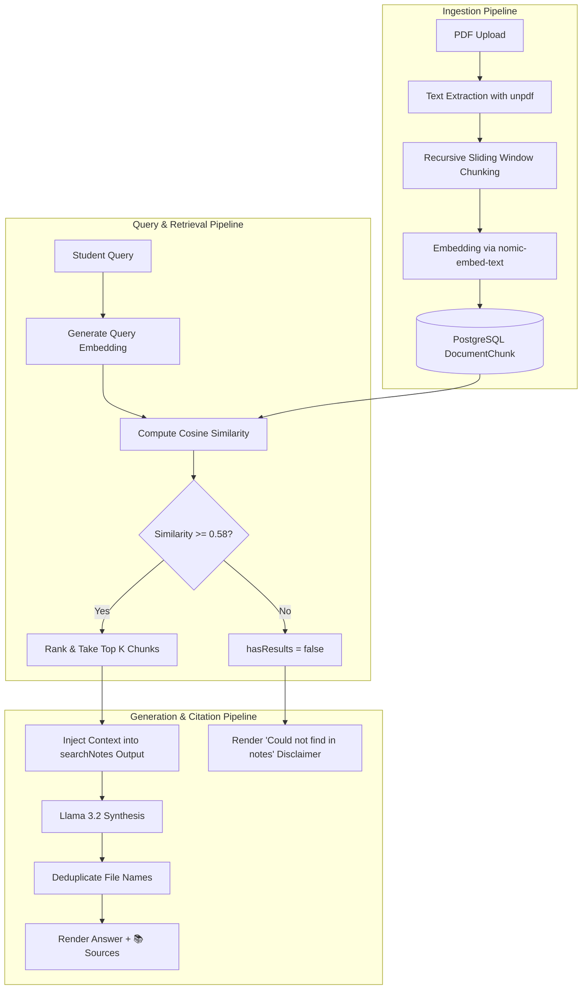

# Retrieval-Augmented Generation (RAG) Architecture & Pipeline

**Target Use Case**: Course notes retrieval, lecture slide question-answering, syllabus lookup, and citation extraction.  
**Embedding Model**: `nomic-embed-text` (768 dimensions)  
**Chat Model**: `llama3.2` via Ollama  
**Vector Similarity**: Cosine Similarity ($\ge 0.58$)

---

## 1. Complete End-to-End Pipeline



---

## 2. Ingestion Stages

### Step 1: Text Extraction (`unpdf`)
- When a student uploads a course PDF through `/api/notes/upload`, the file buffer is passed to `unpdf`.
- Non-text artifacts, repetitive footers, and invalid character sequences are sanitized.
- If the file is corrupted or lacks readable text, ingestion errors cleanly before chunking.

### Step 2: Recursive Chunking
- **Chunk Size**: Target length of approximately **800 characters**.
- **Sliding Overlap**: **150 characters** overlap between consecutive chunks to preserve semantic context across chunk boundaries.
- **Metadata Tagging**: Each chunk is tagged with:
  - `documentId`: Foreign key to parent `NoteDocument`.
  - `userId`: Enforces strict tenant isolation.
  - `chunkIndex`: Monotonically increasing integer ($0, 1, 2, \dots$) preserving sequence.

### Step 3: Dense Vector Embeddings
- The chunk text is dispatched to Ollama's `/api/embed` endpoint using `nomic-embed-text`.
- Generates a **768-dimensional normalized floating-point vector**.
- Vector data is saved directly in PostgreSQL in the `DocumentChunk.embedding` array.

---

## 3. Retrieval & Similarity Scoring

### Cosine Similarity Computation
Cosine similarity evaluates the angular difference between the query vector $Q$ and candidate chunk vector $C$:
$$\text{CosineSimilarity}(Q, C) = \frac{\sum_{i=1}^{768} Q_i \cdot C_i}{\sqrt{\sum_{i=1}^{768} Q_i^2} \cdot \sqrt{\sum_{i=1}^{768} C_i^2}}$$

### Relevance Threshold
- **Relevance Gate**: Minimum similarity threshold of **`0.58`** (`minSimilarity = 0.58`).
- Any chunk scoring below `0.58` is eliminated to prevent injecting noisy or irrelevant text into the context window.
- **Top-K Limit**: Selects up to the top **6** highest-scoring chunks (`topK = 6`).

---

## 4. Retrieval Scenarios

### Positive RAG (Context Found)
- **Scenario**: The student asks a question directly addressed in an uploaded note (e.g. *"Explain Timsort using my uploaded notes."*).
- **Execution Flow**:
  1. The agent invokes `searchNotes({ query: "Timsort" })`.
  2. `retrieveRelevantChunks` retrieves matching chunks from `CS301_Timsort_Notes.pdf` (e.g. similarity `0.785`).
  3. Chunk content is provided to Llama 3.2.
  4. Llama 3.2 synthesizes a grounded answer explaining Timsort's hybrid merge/insertion sorting algorithm.
  5. The citation extractor parses unique document titles and appends:
     ```markdown
     📚 **Sources**
     - `CS301_Timsort_Notes.pdf`
     ```
  6. The frontend renders the answer along with an interactive, clickable source badge displaying the document title and similarity rating.

### Negative RAG (Anti-Hallucination)
- **Scenario**: The student asks to search notes for a topic absent from their uploaded files (e.g. *"Explain binary search using my uploaded notes."* when only Timsort notes exist).
- **Execution Flow**:
  1. The agent invokes `searchNotes({ query: "binary search" })`.
  2. Cosine similarity against all chunks yields scores below `0.58`.
  3. `searchNotes` returns `{ hasResults: false, results: [], chunks: [] }`.
  4. System prompt rules mandate:
     *"If searchNotes returns hasResults: false, do not invent notes and do not fabricate citations."*
  5. The agent explicitly responds:
     *"I couldn't find relevant information in your uploaded notes. I can still give you a general explanation if you'd like."*
  6. **Citations Array**: Returns `sources: []`. No citation block is appended.

---

## 5. Multi-Source Retrieval & Deduplication

When a student's course notes span multiple documents (e.g. `Algorithms_Lecture1.pdf` and `Algorithms_Lecture2.pdf`):
- `searchNotes` aggregates the top matching chunks across all owned documents.
- Multiple chunks originating from the *same* document (e.g. chunk 1 and chunk 3 of `Algorithms_Lecture1.pdf`) are collapsed so that `Algorithms_Lecture1.pdf` is cited **only once**.
- If two distinct documents contribute relevant chunks, both are cleanly listed:
  ```markdown
  📚 **Sources**
  - `Algorithms_Lecture1.pdf`
  - `Algorithms_Lecture2.pdf`
  ```
- No hallucinated page numbers or phantom file names are permitted.

---

## 6. Conversational Memory & Fresh Search Dynamics

### Multi-Turn Context Continuity
- **Turn 1**: Student asks *"Explain Timsort using my uploaded notes."* -> `searchNotes` runs; answer and citation generated.
- **Turn 2**: Student asks *"What are its advantages?"* -> The agent resolves pronoun *"its"* to Timsort from conversation memory. It answers conceptually without re-running vector search, eliminating redundant database operations.
- **Turn 3**: Student asks *"Give me a simple example."* -> The agent provides a numeric sorting walkthrough, maintaining the active topic.

### Explicit Fresh Search
- If during an ongoing conversation the student specifically asks:
  *"Search my notes again for Timsort."* or *"Look up Timsort in my notes again."*
- The agent's fresh-data detection heuristic recognizes the explicit re-query intent, invokes a fresh `searchNotes` execution, and regenerates citations with current database state.
