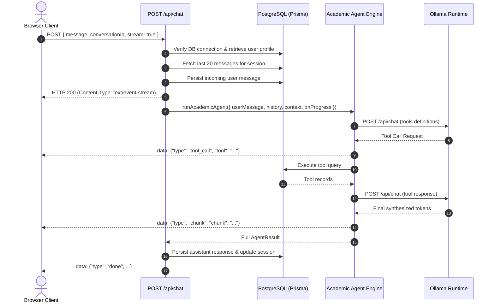
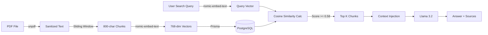
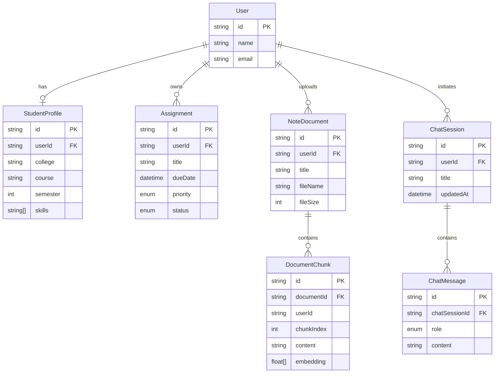

# Technical Architecture Specification

**System**: AI Student Agent  
**Version**: 1.0.0 (Production Verified)  
**Stack**: Next.js 16 (App Router), TypeScript 5, Tailwind CSS, Prisma ORM, PostgreSQL 16, Ollama (`llama3.2` + `nomic-embed-text`)

---

## 1. Architecture Overview

The **AI Student Agent** is designed as a modular, privacy-preserving, and decoupled full-stack architecture. Unlike traditional monolithic chat systems that rely on proprietary cloud LLMs, this system executes both neural chat inference and embedding generation completely on-premise using **Ollama**.

```mermaid
graph TD
    User([Student Client]) <--> NextUI[Next.js App Router Frontend]
    NextUI <--> APIRoute[Next.js API Routes /api/chat]
    APIRoute <--> AgentLoop[Academic Agent Core Engine]
    AgentLoop <--> ToolReg[Agent Tool Registry]
    
    subgraph Local Storage & Database
        ToolReg <--> PrismaClient[Prisma ORM Client]
        PrismaClient <--> PostgresDB[(PostgreSQL 16 Engine)]
    end
    
    subgraph Local AI Provider (Port 11434)
        AgentLoop <--> OllamaProvider[Ollama AI Provider Client]
        OllamaProvider <--> Llama[Llama 3.2 Chat / Tool Call Model]
        ToolReg <--> Nomic[nomic-embed-text Vector Embeddings]
    end
```

---

## 2. Frontend Architecture

The frontend is built with React 19 and Next.js 16 App Router using client/server separation:

- **App Shell (`src/components/layout/AppShell.tsx`)**: Responsive multi-view layout supporting desktop sidebars and animated mobile navigation drawers.
- **Chat Container (`src/app/chat/page.tsx`)**: Master client orchestrator managing:
  - Active conversation ID and conversation switching.
  - History synchronization via `GET /api/chat`.
  - Stream consumption via `ReadableStream` and Server-Sent Events (SSE).
  - Optimistic message creation and progressive text accumulation.
  - Error state handling and automatic retry presentation.
- **Message List (`src/components/chat/ChatWindow.tsx`)**:
  - Empty state displaying the welcome hero and 5 interactive quick-start cards.
  - Auto-scroll lock behavior using `scrollIntoView({ behavior: 'smooth' })`.
- **Message Bubble (`src/components/chat/MessageBubble.tsx`)**:
  - Markdown rendering with fenced code block support.
  - Real-time tool execution badges (`✓ Searched your notes`, `✓ Checked upcoming deadlines`).
  - Collapsible source citation cards with document name and cosine similarity badges.
- **Activity Indicator (`src/components/chat/LoadingIndicator.tsx`)**:
  - Displays real-time status pulses reflecting the agent's current stage (`Thinking...`, `Searching your notes...`, `Building your study plan...`).

---

## 3. API Architecture

All agent interactions route through `src/app/api/chat/route.ts`:



The endpoint provides dual-mode compatibility:
1. **Streaming SSE (`stream: true`)**: Uses `new Response(stream, { headers: { 'Content-Type': 'text/event-stream' } })` emitting line-delimited JSON chunks.
2. **Non-Streaming JSON (`stream: false` / omitted)**: Awaits the agent loop and returns a JSON payload matching `{ message, conversationId, toolCalls, isSimulated, sources }`.

---

## 4. Agent Architecture

The agent engine (`src/lib/agent/agent.ts`) executes an autonomous while-loop capped at `MAX_TOOL_ITERATIONS = 5` to prevent infinite recursion:

1. **Intent Gating (`requiresStudentTools`)**:
   - Queries not asking for student data (e.g. general questions like *"What is recursion?"*) bypass tool exposure completely (`toolChoice: 'none'`).
   - Personal data, note references, or study planning queries activate tool exposure (`toolChoice: 'auto'`).
2. **Context Assembly**:
   - Compiles a system prompt tailored to the student (`studentName`, `course`, `semester`).
   - Appends up to 20 past turns from conversation history.
   - Appends the current student turn.
3. **Execution Loop**:
   - Calls Ollama with Llama 3.2.
   - If Llama 3.2 outputs tool calls, each tool is verified against `toolRegistry`, executed server-side, and results are appended as role `'tool'`.
   - The loop continues until Llama 3.2 generates its final synthesized text answer.
4. **Post-Processing & Citations**:
   - Extracts executed tools and formats source citations.
   - If negative RAG occurred, strips hallucinated citation tags and ensures an honest missing note acknowledgment.

---

## 5. Tool Registry Architecture

The central registry (`src/lib/agent/toolRegistry.ts`) provides a type-safe interface for registering and executing tools:

```typescript
export interface AgentTool<TInput = any, TOutput = any> {
  name: string;
  description: string;
  parameters: {
    type: 'object';
    properties: Record<string, any>;
    required?: string[];
  };
  execute: (input: TInput, context: AgentContext) => Promise<TOutput>;
}
```

Five verified tools are registered:
1. `searchNotesTool` (`src/lib/agent/tools/searchNotes.ts`)
2. `getAssignmentsTool` (`src/lib/agent/tools/getAssignments.ts`)
3. `getUpcomingDeadlinesTool` (`src/lib/agent/tools/getUpcomingDeadlines.ts`)
4. `getStudentProfileTool` (`src/lib/agent/tools/getStudentProfile.ts`)
5. `createStudyPlanTool` (`src/lib/agent/tools/createStudyPlan.ts`)

Every tool execution receives an `AgentContext` object containing verified server-side identifiers:
```typescript
export interface AgentContext {
  userId: string;
  studentName?: string;
  userEmail?: string;
  course?: string | null;
  semester?: number | null;
  college?: string | null;
}
```

---

## 6. RAG Architecture



- **Relevance Gate**: Uses a minimum cosine similarity threshold of `0.58`.
- **Top-K Window**: Retrieves the top 4 to 6 highest-scoring chunks.
- **Negative RAG Handling**: If no chunks score above `0.58`, `hasResults` is set to `false`. The model is instructed to acknowledge the absence of notes and avoid citation hallucination.

---

## 7. Embedding Pipeline

Vector embeddings are generated using Ollama's native `/api/embed` endpoint:
- **Model**: `nomic-embed-text`
- **Dimension**: 768-dimensional normalized floating-point numbers.
- **Cosine Similarity Formula**:
  $$\text{Similarity}(A, B) = \frac{A \cdot B}{\|A\| \|B\|}$$
- Since `nomic-embed-text` outputs unit-normalized vectors, the dot product directly reflects cosine similarity.

---

## 8. PostgreSQL & Prisma Architecture



---

## 9. Conversation Memory Architecture

- **Persistence Layer**: All messages persist to PostgreSQL (`chat_sessions` and `chat_messages` tables).
- **Session Bounding**: Bounded at the database query level with `take: 20` and `orderBy: { createdAt: 'desc' }`. Chronological ordering is restored before LLM dispatch.
- **Follow-up State Machine**:
  - If a user modifies an existing plan (*"Make Day 3 easier"*), the agent treats history as the source of truth and avoids tool calls.
  - If a user requests real-time data (*"Do I have any assignments now?"*), the agent bypasses history to query the database.

---

## 10. Streaming Architecture

The Server-Sent Events implementation operates over standard HTTP/1.1 and HTTP/2:
- **MIME Type**: `text/event-stream; charset=utf-8`
- **Headers**:
  - `Cache-Control: no-cache, no-transform`
  - `Connection: keep-alive`
- **Event Dispatcher**: `onProgress` callback in `runAcademicAgent` passes events to `controller.enqueue(encoder.encode('data: ...\n\n'))`.
- **Termination**: Stream closes cleanly on the final `'done'` event or catches stream errors emitting `'error'` events before `controller.close()`.

---

## 11. Source Citation System

- Document chunks retain `documentId`, `fileName`, and `similarity`.
- Upon execution of `searchNotes`, retrieved results are stored in the execution summary.
- The agent extracts unique `fileName` entries, deduplicating multiple chunks from the same document.
- Citations are appended to the response in a structured format:
  ```markdown
  📚 **Sources**
  - `CS301_Timsort_Notes.pdf`
  ```
- No arbitrary page numbers or fabricated section headers are permitted.

---

## 12. Security Model

1. **User Scoping**: Every database lookup enforces `userId = context.userId`. Client payloads cannot supply or tamper with `userId`.
2. **Least Privilege Queries**: `getStudentProfile` explicitly uses Prisma `select` to omit passwords, tokens, and system timestamps.
3. **Prompt Injection Containment**: Ingested notes are placed within isolated tool outputs. The system prompt instructs the agent to treat note text as subject matter to summarize, rejecting any instructions embedded within notes.
4. **Environment Isolation**: Database URLs and credentials are stored strictly in `.env.local` (ignored in `.gitignore`).

---

## 13. Error Handling & Resilience

- **Sanitized Responses**: General runtime exceptions return sanitized messages (`An unexpected error occurred while communicating with the AI agent.`), hiding Prisma stack traces and SQL queries.
- **Ollama Offline Recovery**: If Ollama is unreachable, `isNetworkOrTimeoutError` triggers a clean HTTP 503 response: `Ollama is not running. Please start Ollama and try again.`
- **Database Degradation**: If PostgreSQL experiences connection latency, conversation persistence fails gracefully without dropping active user LLM generation.

---

## 14. Data Flow

```mermaid
flowchart TD
    subgraph Ingestion
        PDF[PDF File] --> Parse[Text Extraction]
        Parse --> Chunk[Chunk Generation]
        Chunk --> Embed[Ollama Embeddings]
        Embed --> Store[(PostgreSQL pgvector)]
    end

    subgraph Query Execution
        Query[Student Query] --> API[/api/chat]
        API --> AgentEngine[Agent Engine]
        AgentEngine --> Tool{Requires Tool?}
        Tool -- Yes --> Exec[Tool Execution]
        Exec --> Store
        Exec --> PostTool[Tool Output to Thread]
        PostTool --> LLM[Llama 3.2]
        Tool -- No --> LLM
        LLM --> Stream[SSE Stream]
        Stream --> UI[Interactive Chat UI]
    end
```

---

## 15. Known Technical Boundaries

1. **Hardware-Dependent Inference Latency**: Llama 3.2 token generation runs on local compute. First token latency is fast (~115 ms), while lengthy 500-token answers take ~10–13 seconds to complete.
2. **Context Window Size**: Llama 3.2 supports 128k context, but Ollama runtime is configured with `num_predict: 1800` and `boundedHistory = 20` to optimize memory usage on typical laptops.
3. **Format Support**: Ingestion is tailored for text-heavy academic PDF slides and handouts. Complex scanned bitmap PDFs require OCR preprocessing before upload.
